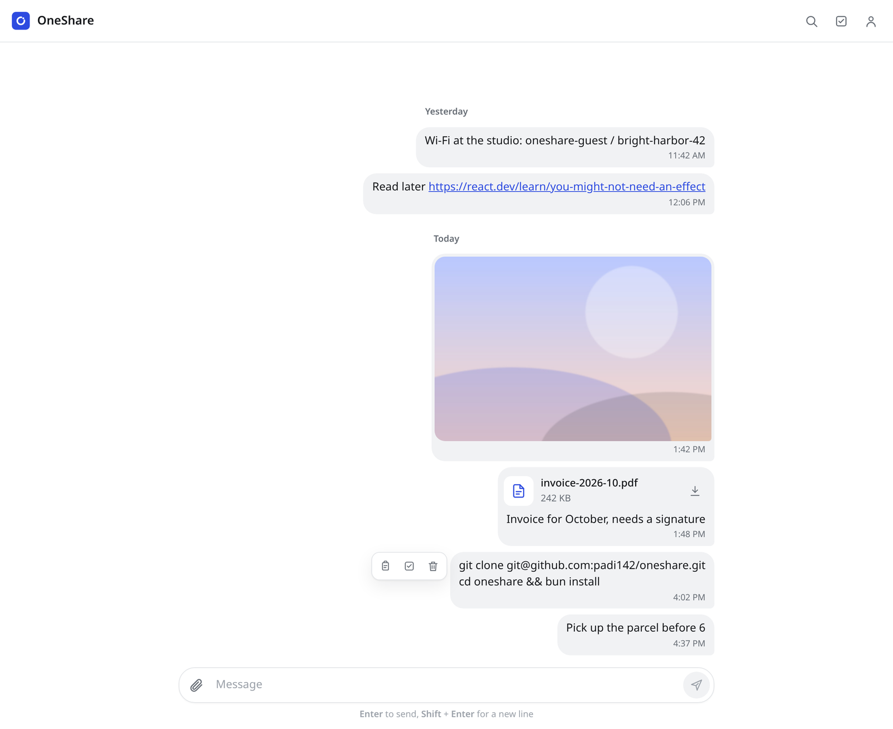
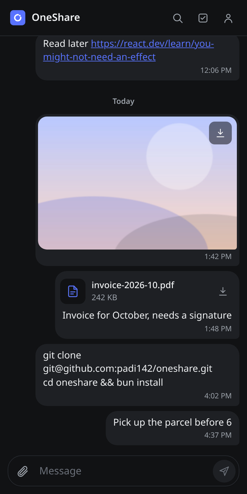

<p align="center">
  
</p>

<h1 align="center">OneShare</h1>

<p align="center">
  Send notes, links, photos and files between your own devices.<br />
  One account, one realtime inbox, on Linux, macOS, Android, iOS and the command line.
</p>

<p align="center">
  
  &nbsp;
  
</p>

## Why

Moving a file from a phone to a laptop usually means emailing yourself, messaging yourself, or uploading to a cloud drive and digging it out again. OneShare is a private chat with yourself: whatever you send shows up instantly on every device that is signed in to your account.

## Features

- **Realtime sync.** Messages appear on every signed-in device as soon as they are sent, with optimistic local updates and paginated history.
- **Files up to 500 MB.** Images and videos render inline, everything else shows as a downloadable file card. Uploads start the moment you attach a file and report progress.
- **Drop, paste or pick.** Drag files anywhere onto the window, paste images from the clipboard, or (on desktop) paste a file path to attach the file it points to.
- **Bulk actions.** Select several messages to download all their files at once or delete them everywhere.
- **Search.** Filter by message text or file name with <kbd>Ctrl</kbd>/<kbd>Cmd</kbd> + <kbd>K</kbd>.
- **Telegram-style files.** Tap a file to open it in the app that handles it, downloading it first if needed. Desktop saves into `~/Downloads/OneShare` without a dialog and never overwrites existing files. Android and iOS keep files in OneShare's own storage with no system download UI. Android opens them with the matching app and installs APKs directly, and iOS previews them in Quick Look.
- **CLI for scripts and agents.** `oneshare report.pdf --message "Q3 numbers"` uploads from a terminal, reusing the desktop app's session.
- **Light and dark mode** that follow the system setting, and layouts that adapt from a 320 px phone to a desktop window. Touch devices reveal message actions with a tap; pointer devices on hover.

## Architecture

```
┌─────────────── one React + Vite renderer ───────────────┐
│  Electron (Linux, macOS)   Capacitor (Android, iOS)  Web │
└──────────────────────────────┬───────────────────────────┘
                               │ websocket (queries, mutations)
┌──────────────────────────────▼───────────────────────────┐
│ Convex                                                   │
│  • Convex Auth (email + password)                        │
│  • messages / messageAttachments tables, per-user index  │
│  • file storage with upload URLs                         │
└──────────────────────────────▲───────────────────────────┘
                               │ HTTP client
                      cli/oneshare.ts (Node)
```

| Area    | Choice                                                                                     |
| ------- | ------------------------------------------------------------------------------------------ |
| UI      | React 19, TypeScript, plain CSS with design tokens, no UI framework                        |
| Desktop | Electron with context isolation, sandboxed renderer, strict CSP and a typed preload bridge |
| Mobile  | Capacitor 8 with small native file plugins (Java on Android, Swift on iOS)                 |
| Backend | Convex: reactive queries, mutations, file storage and auth in one TypeScript codebase      |
| CLI     | Single-file Node script bundled with esbuild                                               |
| Tooling | Bun, Vite 8, TypeScript, Prettier, electron-builder                                        |

### Security notes

- Every Convex query and mutation resolves the signed-in user first (`convex/lib/authorization.ts`) and scopes reads and writes to that account. Attachments are separate documents indexed by user, message and storage ID, so ownership checks never scan unrelated data.
- Server-side validation limits text length, attachment count, per-file and per-message size, file name length, MIME type format and media dimensions.
- Deleting a message deletes its stored files, not just the database row.
- The Electron renderer has no Node access. File reads and downloads go through narrow IPC handlers that validate their inputs, and external links open in the system browser.

## Project layout

```
src/            React renderer (components, hooks, lib)
convex/         Backend schema, auth and message functions
electron/       Main process, preload bridge and build scripts
cli/            oneshare command-line uploader
android/, ios/  Capacitor native projects
assets/brand/   Source SVGs for the app icon
scripts/        Asset generation
```

## Getting started

Requirements: [Bun](https://bun.sh), Node 20.19+, and a free [Convex](https://convex.dev) account.

```bash
bun install
bunx convex dev          # creates a deployment and writes VITE_CONVEX_URL to .env.local
bunx @convex-dev/auth    # one-time: generates the auth keys on the deployment
bun run dev:web          # http://127.0.0.1:5173
```

Run the desktop shell against the Vite dev server in a second terminal:

```bash
bun run dev:desktop
```

## Building

```bash
bun run typecheck
bun run lint
bun run dist             # AppImage + deb on Linux, DMG + ZIP on macOS, in release/
```

### Android and iOS

Install Android Studio (or Xcode for iOS), then:

```bash
bun run cap:sync
bun run cap:open:android # or: bunx cap open ios
```

### CLI

```bash
bun run build:cli        # writes dist-cli/oneshare.mjs
node dist-cli/oneshare.mjs login
node dist-cli/oneshare.mjs ./photo.jpg ./notes.md --message "From the server"
node dist-cli/oneshare.mjs --help
```

The first upload reuses the session from the desktop app when it is installed. Use `--json` for machine-readable output.

## Icons

All app icons and splash screens (desktop, favicon, Android adaptive and legacy, iOS) are generated from one geometric definition:

```bash
bun run icons            # needs Inkscape and ImageMagick
```
